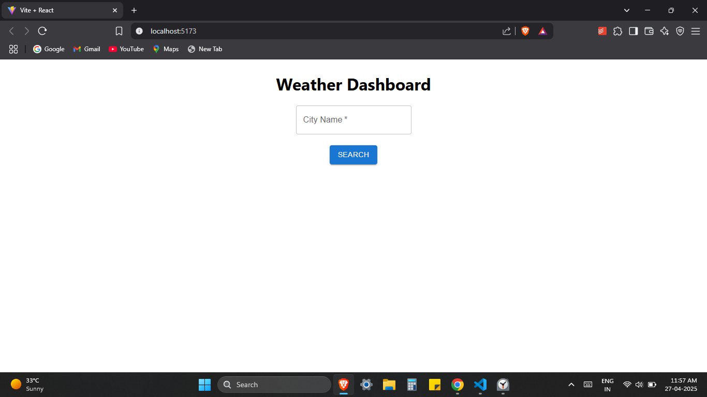
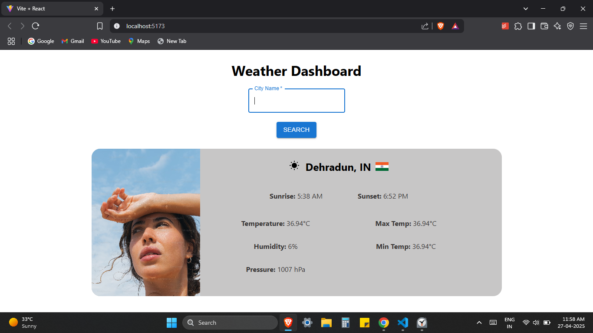

# Weather Dashboard 🌦️

A simple and interactive Weather Dashboard web app that displays real-time weather information based on the user's search. Built using **HTML**, **CSS**, and **JavaScript**, and powered by the **OpenWeatherMap API**.

## 🚀 Features

- Search for current weather by city name
- Displays:
  - City name
  - Temperature
  - Humidity
  - Wind speed
  - Weather description
  - Weather icon
- Responsive and user-friendly UI
- API integration using `fetch()` for live data updates

## 🛠️ Technologies Used

- HTML5
- CSS3
- JavaScript (Vanilla JS)
- OpenWeatherMap API

## 📸 Screenshots

| Search View | Weather Info View |
|:-----------:|:-----------------:|
|  |  |

## 🔑 How to Get an OpenWeatherMap API Key

- Visit [OpenWeatherMap](https://openweathermap.org/api)
- Sign up for a free account
- Navigate to the **API keys** section
- Generate a new API key
- Copy and paste it into your `script.js` file

## ✨ Future Improvements

- Add 5-day weather forecast
- Save previously searched cities using LocalStorage
- Improve UI with animations and better responsiveness
- Dark mode support

## 📄 License

This project is open-source and available under the [MIT License](LICENSE).
